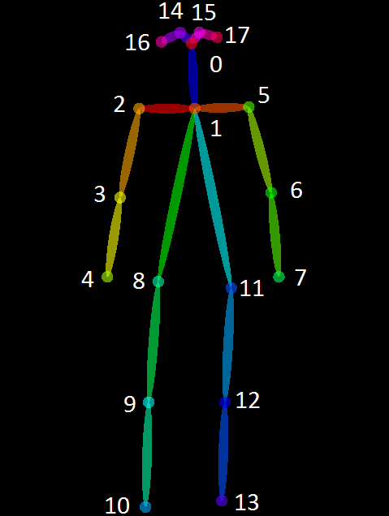

## OpenPose model implementation

#### Description:

This notebook is largely based on the model implementation of _OpenPose_(C) by Kunal Bhashkar (<bhashkar.brand@gmail.com>) available at: https://github.com/kunalBhashkar/OpenPose-Pose-Estimation. _OpenPose_ is the first open-source realtime system for multi-person 2D pose detection, including body, foot, hand, and facial keypoints, by Cao et al. (2018). The CNN neural network architecture ...[to be continued]

#### Reference:
See: Zhe Cao, Gines Hidalgo, Tomas Simon, Shih-En Wei, Yaser Sheikh, "[Computer Vision and Pattern Recognition](https://arxiv.org/abs/1812.08008)," arXiv:1812.08008 [cs.CV] (Dec. 2018).

#### Computing environment requirements and dependencies:
Software requirements: Beside the _Openpose_ model, this notebook was successfully built in a Python 3.7.0 virtual environment based on custon iPython kernel, and on the following  packages: 
    - Tensorflow
    - Pytorch
    - OpenCV

#### Hardware compatibility:
    - CUDA (Nvidia GPU)
    - OpenCL (AMD GPU)
    - non-GPU (CPU-only)

#### Usage:
- Command-line demo for built-in functionality.
- C++ API and Python API for custom functionality. E.g., adding your custom inputs, pre-processing, post-posprocessing, and output steps.

To run the notebook code, first consolidate the 3 Models/Coco/*.caffemodel_split0{1,2,3} files, issuing the following cmd in terminal from the same directory level where the files splits are located:

    $ cat *.caffemodel_split0{1,2,3} >| pose_iter_440000.caffemodel

For further details, check the [major released features](https://github.com/CMU-Perceptual-Computing-Lab/openpose/blob/master/doc/07_major_released_features.md) and [release notes](https://github.com/CMU-Perceptual-Computing-Lab/openpose/blob/master/doc/08_release_notes.md) docs.

#### COCO pose estimation model output format:

### Copyright and licensing information
OpenPose is freely available for free non-commercial use, and may be redistributed under the conditions described in the licensing terms as represented in the accompanyig file **License.md** in this repo.
